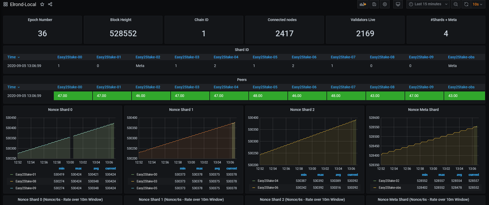
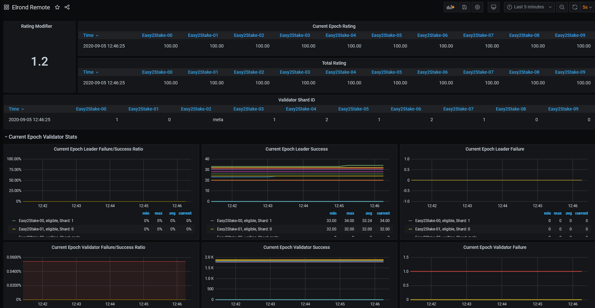

# Description
Easy to use, customizable, bash script collecting data from Elrond nodes and printing them in a Prometheus compatible format.



It started as a simple metric exporter used during the battle-of-nodes and with each necessity we added more and more metrics. The slow execution time of bash results in low performance when exporting metrics for more than 10 nodes. It also depends on the host machine.

On a dual-core, HT enabled VM the performance collecting remote metrics for 10 nodes is around 4 seconds on average.

Please keep in mind that this is only an exporter. A complete working setup requires:
- An existing Grafana installation
- An existing Prometheus installation
- Prometheus Node Exporter installed on the host running the elrond-exporter.sh script

### **Check out our complete Grafana, Prometheus solution [here](https://github.com/easy2stake/elrond/tree/master/monitoring-infra).**
# How to use it

## 1. Set the Variables

The script collects two types of metrics:
- **Local metrics:** Metrics collected from your node RPC/node/status page.


- **Remote metrics:** Metrics collected using an OBSERVER_URL


The only variable that MUST be setup in order to run the script is IDENTITY:
```sh
#Example:
IDENTITY=easy2stake
```
However, by running the script setting only IDENTITY it will collect validator performance metrics but it will not collect the local metrics, directly from your node http://RPC-URL/node/status.

In order to collect **local metrics** edit the beginning section of the script like this:
```sh
LOCAL_METRICS=1
#Edit the example list below with your own nodes. The RPC port has to be reachable from the location of the script:
LOCAL_NODES=(http://rpc-url:8080 http://rpc-url:8081)
```

**Variables explained:**
- **LOCAL_METRICS:** Enable (1) or disable (0) the local metrics collection. By default this is set to 0
- **LOCAL_NODES:** Array with each one of the node RPC that you want to collect local metrics from
- **REMOTE_METRICS:** Enable (1) or disable (0) the remote metrics collection. By default this is set to 1. DO NOT ENABLE this metrics if you are running the script on the same machine as your validator. **It can impact validator performance.**
- **OBSERVER_URL:** The observer to be used in order to collect the REMOTE_METRCS from. By default this is set to https://api.elrond.com
- **IDENTITY:** Your keybase identity. This is a mandatory variable.

## 2. Run the script

By simply running the script it will print the metrics on the terminal.
```sh
bash elrond-exporter.sh
```

Setup cronab and import the metrics to Prometheus using node_exporter collector.

Example on how to start node_exporter with the collector:
```sh
ExecStart=/usr/local/bin/node_exporter \
    --collector.cpu \
    --collector.diskstats \
    --collector.filesystem \
    --collector.loadavg \
    --collector.meminfo \
    --collector.systemd \
    --collector.tcpstat \
    --web.listen-address=:9100 \
    --web.telemetry-path="/metrics" \
    --collector.textfile.directory="/home/ubuntu/.elrond-exporter/" #This is the collector line. Change the directory with your own.
```
Add a cron job to write metrics to collector directory configured in node_exporter:
```sh
* * * * * $HOME/elrond/elrond-exporter.sh > $HOME/.elrond-exporter/metrics.prom
```

# Future
A go / python implementation of this exporter.

**Reach us on telegram:** https://t.me/easy2stake
